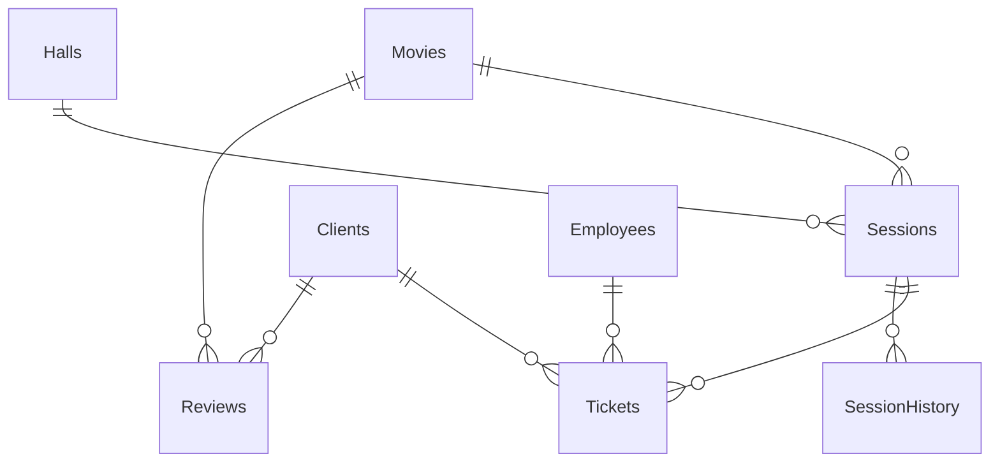

# database
## Концептуальная модель

### Описание таблиц
Кинотеатр (система бронирования билетов) Таблицы: Фильмы Залы Сеансы Билеты Клиенты Сотрудники Отзывы 

Фильмы  – хранит информацию о фильмах (название, жанр, длительность, возрастной рейтинг). 

Залы  – содержит данные о залах (количество мест, тип экрана, звуковая система). 

Сеансы – связывает фильмы с залами и временем показа, указывает стоимость билетов. 

Билеты  – фиксирует купленные билеты (место, дата покупки, статус оплаты). 

Клиенты – содержит данные о зрителях (ФИО, контактная информация, бонусные баллы). 

Сотрудники  – включает информацию о персонале (должность, зарплата, дата приема). 

Отзывы  – хранит оценки и комментарии клиентов о фильмах.
#### Связи между таблицами:
Таблица movies (Фильмы) связана с таблицей sessions (Сеансы) по принципу "один ко многим". Один фильм может иметь несколько сеансов, но каждый сеанс относится только к одному фильму. Это реализуется через внешний ключ movie_id в таблице sessions, ссылающийся на id фильма.
Таблица halls (Залы) также связана с sessions по принципу "один ко многим". Один зал может быть задействован во множестве сеансов, но каждый сеанс проводится только в одном зале. В таблице sessions поле hall_id указывает на конкретный зал из таблицы halls.
Sessions (Сеансы) и tickets (Билеты) также находятся в связи "один ко многим". Один сеанс может включать множество билетов, каждый из которых соответствует отдельному месту. Поле session_id в таблице tickets указывает, к какому сеансу принадлежит билет.
Таблица clients (Клиенты) связана с tickets: один клиент может приобрести несколько билетов, но каждый билет относится к одному клиенту. Связь осуществляется через внешний ключ client_id в таблице tickets.
Аналогично, таблица clients связана с reviews (Отзывы). Один клиент может оставить несколько отзывов, каждый из которых фиксируется в таблице reviews и связан с клиентом через client_id.
Таблица movies также связана с reviews: один фильм может иметь много отзывов, но каждый отзыв относится к одному фильму. Это отражается через внешний ключ movie_id в таблице reviews.
Таблица employees (Сотрудники) в данной структуре является самостоятельной и пока не связана напрямую с другими таблицами. Однако при необходимости можно расширить структуру и добавить, например, связь между сотрудниками и выданными билетами или обслуживаемыми сеансами.
Таким образом, связи между таблицами соответствуют логике работы кинотеатра, позволяют обеспечить целостность данных, избежать дублирования информации и эффективно обрабатывать операции бронирования, отзывов и учёта клиентов.
## Логическая модель


### Обоснование выбора нормальной формы
База данных кинотеатра разработана с соблюдением требований третьей нормальной формы (3NF), что обеспечивает логичную, чистую и расширяемую структуру данных.
1NF — Первая нормальная форма:
Все поля в таблицах имеют атомарные значения: например, в таблице билетов каждое поле отвечает только за одно значение — одно место, одна дата покупки, один статус оплаты. В каждой таблице данные строго структурированы и не содержат повторяющихся групп. Каждая запись однозначно идентифицируется с помощью первичного ключа (id).
2NF — Вторая нормальная форма:
Во всех таблицах все неключевые атрибуты полностью зависят от первичного ключа. Например, в таблице sessions цена, время сеанса и зал напрямую зависят от конкретного id-сеанса. Нет частичных зависимостей от части составного ключа, потому что во всех таблицах используется простой первичный ключ (id).
3NF — Третья нормальная форма:
Отсутствуют транзитивные зависимости. Вся информация хранится строго в тематически подходящих таблицах. Например:
Информация о фильмах (жанр, длительность, возрастной рейтинг) не дублируется в сеансах, а хранится отдельно в таблице movies.
Данные клиентов (ФИО, контактная информация) не повторяются в билете, а ссылаются через внешний ключ client_id.
Отзывы не содержат данных о фильмах напрямую — только ссылку на movie_id.
Что даёт соблюдение 3NF:
Минимизация дублирования — одна и та же информация (например, название фильма) хранится только в одной таблице.
Целостность данных — если обновляется информация о клиенте или фильме, это делается в одном месте и сразу отражается во всех связанных данных.
Гибкость и расширяемость — можно легко добавлять новые сущности (например, акции, бронирования или бонусные программы), не затрагивая существующую структуру.
Таким образом, выбор третьей нормальной формы делает базу данных кинотеатра более надёжной, понятной и удобной для долгосрочной работы и развития.
## Обоснование выбора типа версионирования (SCD)
В системе бронирования билетов кинотеатра важно отслеживать изменения определённых данных во времени — таких как информация о клиентах, ценах на сеансы, зарплатах сотрудников или условиях обслуживания. Для этого используется подход управления историей изменений, называемый Slowly Changing Dimensions (SCD) — "медленно изменяющиеся измерения".
В данной системе уместно применять тип SCD 2, поскольку он позволяет сохранять полную историю изменений данных, а не только текущее состояние.
Почему выбран именно SCD Type 2:
1. Необходимость исторического анализа.
Например, важно знать, по какой цене клиент покупал билет на конкретный сеанс, даже если стоимость этого сеанса позже изменилась. Или — какие бонусные баллы были у клиента на момент покупки, даже если баланс позже изменился.
2. Поддержка бизнес-отчетности.
SCD 2 позволяет формировать отчёты с учётом того, какими были данные в определённый момент времени — например, отчет по продажам в декабре с актуальными на тот момент ценами и клиентскими статусами.
3. Минимизация потери данных.
Вместо перезаписи информации, система создаёт новую версию записи с новой датой начала действия (и при необходимости — датой окончания). Таким образом, ни одна информация не теряется.
4. Учет изменений в персонале.
Если у сотрудника изменилась должность или зарплата, важно сохранить как текущие, так и предыдущие значения, чтобы понимать историю занятости и оценивать эффективность.
Пример применения SCD 2:
В таблице sessions или employees можно добавить поля valid_from и valid_to, а также логический флаг is_current. Это позволит:
хранить несколько версий записи;
видеть, какие данные были актуальны на определённую дату;
обеспечить корректные связи с другими таблицами на момент операции (например, продажа билета, начисление бонусов и т.д.).
Таким образом, выбор SCD Type 2 позволяет точно отслеживать изменения, сохранять историю и обеспечивать гибкую аналитику без потери данных, что особенно важно в системе, связанной с продажами, обслуживанием клиентов и кадровым учетом.
## Физическая модель

### Таблица: `movies` (Фильмы)

| Название          | Описание             | Тип данных    | Ограничения                  |
|-------------------|----------------------|---------------|-------------------------------|
| movie_id          | ID фильма            | SERIAL        | PK                            |
| title             | Название             | TEXT          | NOT NULL                      |
| genre             | Жанр                 | TEXT          | NOT NULL                      |
| duration_minutes  | Длительность (мин.)  | INTEGER       | NOT NULL                      |
| age_rating        | Возрастной рейтинг   | TEXT          | CHECK (age_rating IN ('0+', '6+', '12+', '16+', '18+')) |

### Таблица: `halls` (Залы)

| Название          | Описание             | Тип данных    | Ограничения                  |
|-------------------|----------------------|---------------|-------------------------------|
| hall_id           | ID зала              | SERIAL        | PK                            |
| seats_count       | Кол-во мест          | INTEGER       | NOT NULL, CHECK (seats_count > 0) |
| screen_type       | Тип экрана           | TEXT          | NOT NULL                      |
| sound_system      | Звуковая система     | TEXT          | NOT NULL                      |

### Таблица: `sessions` (Сеансы)

| Название          | Описание             | Тип данных    | Ограничения                          |
|-------------------|----------------------|---------------|---------------------------------------|
| session_id        | ID сеанса            | SERIAL        | PK                                    |
| movie_id          | ID фильма            | INTEGER       | FK → movies(movie_id)                |
| hall_id           | ID зала              | INTEGER       | FK → halls(hall_id)                  |
| session_time      | Время показа         | TIMESTAMP     | NOT NULL                              |
| ticket_price      | Стоимость билета     | NUMERIC(8, 2) | NOT NULL                              |

### Таблица: `tickets` (Билеты)

| Название          | Описание             | Тип данных    | Ограничения                          |
|-------------------|----------------------|---------------|---------------------------------------|
| ticket_id         | ID билета            | SERIAL        | PK                                    |
| session_id        | ID сеанса            | INTEGER       | FK → sessions(session_id)            |
| client_id         | ID клиента           | INTEGER       | FK → clients(client_id)              |
| seat_number       | Номер места          | TEXT          | NOT NULL                              |
| purchase_date     | Дата покупки         | TIMESTAMP     | NOT NULL                              |
| payment_status    | Статус оплаты        | TEXT          | CHECK (payment_status IN ('paid', 'unpaid', 'refunded')) |

### Таблица: `clients` (Клиенты)

| Название          | Описание             | Тип данных    | Ограничения                  |
|-------------------|----------------------|---------------|-------------------------------|
| client_id         | ID клиента           | SERIAL        | PK                            |
| full_name         | ФИО                  | TEXT          | NOT NULL                      |
| email             | Email                | TEXT          | UNIQUE, NOT NULL              |
| phone             | Телефон              | TEXT          |                               |
| bonus_points      | Бонусные баллы       | INTEGER       | DEFAULT 0                     |
| registration_date | Дата регистрации     | TIMESTAMP     | NOT NULL                      |

### Таблица: `employees` (Сотрудники)

| Название          | Описание             | Тип данных    | Ограничения                  |
|-------------------|----------------------|---------------|-------------------------------|
| employee_id       | ID сотрудника        | SERIAL        | PK                            |
| full_name         | ФИО                  | TEXT          | NOT NULL                      |
| position          | Должность            | TEXT          | NOT NULL                      |
| salary            | Зарплата             | NUMERIC(10,2) | NOT NULL                      |
| hire_date         | Дата приема на работу| DATE          | NOT NULL                      |

### Таблица: `reviews` (Отзывы)

| Название          | Описание             | Тип данных    | Ограничения                          |
|-------------------|----------------------|---------------|---------------------------------------|
| review_id         | ID отзыва            | SERIAL        | PK                                    |
| client_id         | ID клиента           | INTEGER       | FK → clients(client_id)              |
| movie_id          | ID фильма            | INTEGER       | FK → movies(movie_id)                |
| rating            | Оценка               | NUMERIC(2,1)  | CHECK (rating BETWEEN 1 AND 5)        |
| comment           | Комментарий          | TEXT          |                                       |
| review_date       | Дата отзыва          | TIMESTAMP     | NOT NULL                              |

### Таблица: `session_history` (История изменений сеансов) — SCD Type 2

| Название          | Описание             | Тип данных    | Ограничения                          |
|-------------------|----------------------|---------------|---------------------------------------|
| history_id        | ID записи истории    | SERIAL        | PK                                    |
| session_id        | ID сеанса            | INTEGER       | FK → sessions(session_id)            |
| ticket_price      | Цена билета          | NUMERIC(8,2)  | NOT NULL                              |
| session_time      | Время показа         | TIMESTAMP     | NOT NULL                              |
| valid_from        | Дата начала действия | TIMESTAMP     | NOT NULL                              |
| valid_to          | Дата окончания       | TIMESTAMP     | NULL если актуально                   |

### [ddl.sql](ddl.sql)
```postgresql
-- Таблица: Фильмы
CREATE TABLE movies (
    movie_id SERIAL PRIMARY KEY,
    title TEXT NOT NULL,
    genre TEXT NOT NULL,
    duration_minutes INTEGER NOT NULL,
    age_rating TEXT CHECK (age_rating IN ('0+', '6+', '12+', '16+', '18+'))
);

-- Таблица: Залы
CREATE TABLE halls (
    hall_id SERIAL PRIMARY KEY,
    seats_count INTEGER NOT NULL CHECK (seats_count > 0),
    screen_type TEXT NOT NULL,
    sound_system TEXT NOT NULL
);

-- Таблица: Сеансы
CREATE TABLE sessions (
    session_id SERIAL PRIMARY KEY,
    movie_id INTEGER REFERENCES movies(movie_id),
    hall_id INTEGER REFERENCES halls(hall_id),
    session_time TIMESTAMP NOT NULL,
    ticket_price NUMERIC(8,2) NOT NULL
);

-- Таблица: Клиенты
CREATE TABLE clients (
    client_id SERIAL PRIMARY KEY,
    full_name TEXT NOT NULL,
    email TEXT UNIQUE NOT NULL,
    phone TEXT,
    bonus_points INTEGER DEFAULT 0,
    registration_date TIMESTAMP NOT NULL
);

-- Таблица: Сотрудники
CREATE TABLE employees (
    employee_id SERIAL PRIMARY KEY,
    full_name TEXT NOT NULL,
    position TEXT NOT NULL,
    salary NUMERIC(10,2) NOT NULL,
    hire_date DATE NOT NULL
);

-- Таблица: Билеты
CREATE TABLE tickets (
    ticket_id SERIAL PRIMARY KEY,
    session_id INTEGER REFERENCES sessions(session_id),
    client_id INTEGER REFERENCES clients(client_id),
    seat_number TEXT NOT NULL,
    purchase_date TIMESTAMP NOT NULL,
    payment_status TEXT CHECK (payment_status IN ('paid', 'unpaid', 'refunded'))
);

-- Таблица: Отзывы
CREATE TABLE reviews (
    review_id SERIAL PRIMARY KEY,
    client_id INTEGER REFERENCES clients(client_id),
    movie_id INTEGER REFERENCES movies(movie_id),
    rating NUMERIC(2,1) CHECK (rating BETWEEN 1 AND 5),
    comment TEXT,
    review_date TIMESTAMP NOT NULL
);

-- Таблица: История изменений сеансов (SCD Type 2)
CREATE TABLE session_history (
    history_id SERIAL PRIMARY KEY,
    session_id INTEGER REFERENCES sessions(session_id),
    ticket_price NUMERIC(8,2) NOT NULL,
    session_time TIMESTAMP NOT NULL,
    valid_from TIMESTAMP NOT NULL,
    valid_to TIMESTAMP
);
```

### `movies`

```sql
INSERT INTO movies (title, genre, duration_minutes, age_rating) VALUES
('Inception', 'Sci-Fi', 148, '12+'),
('The Matrix', 'Action', 136, '16+'),
('Finding Nemo', 'Animation', 100, '6+'),
('Gladiator', 'Drama', 155, '16+'),
('Toy Story', 'Animation', 81, '0+'),
('Titanic', 'Drama', 195, '12+'),
('The Lion King', 'Animation', 88, '6+'),
('Avatar', 'Sci-Fi', 162, '12+'),
('The Godfather', 'Crime', 175, '18+'),
('Shrek', 'Comedy', 90, '6+'),
('Forrest Gump', 'Drama', 142, '12+'),
('The Dark Knight', 'Action', 152, '16+'),
('Interstellar', 'Sci-Fi', 169, '12+'),
('Coco', 'Animation', 105, '6+'),
('Joker', 'Drama', 122, '18+');
```

### `halls`

```sql
INSERT INTO halls (seats_count, screen_type, sound_system) VALUES
(100, 'IMAX', 'Dolby Atmos'),
(80, 'Standard', 'Dolby Digital'),
(120, '3D', 'Dolby Surround'),
(90, '4DX', 'Dolby Atmos'),
(60, 'Standard', 'Stereo'),
(110, 'IMAX', 'Dolby Digital'),
(85, 'Standard', 'Dolby Surround'),
(100, '3D', 'Dolby Atmos'),
(95, 'Standard', 'Dolby Digital'),
(70, '4DX', 'Dolby Atmos'),
(130, 'IMAX', 'Dolby Surround'),
(75, '3D', 'Stereo'),
(105, 'Standard', 'Dolby Atmos'),
(88, '3D', 'Dolby Digital'),
(92, 'Standard', 'Stereo');
```

###  `clients`

```sql
INSERT INTO clients (full_name, email, phone, registration_date) VALUES
('Ivan Petrov', 'ivan@example.com', '1234567890', NOW()),
('Anna Ivanova', 'anna@example.com', '1234567891', NOW()),
('Sergey Sidorov', 'sergey@example.com', '1234567892', NOW()),
('Olga Petrova', 'olga@example.com', '1234567893', NOW()),
('Dmitry Ivanov', 'dmitry@example.com', '1234567894', NOW()),
('Maria Smirnova', 'maria@example.com', '1234567895', NOW()),
('Nikolay Volkov', 'nikolay@example.com', '1234567896', NOW()),
('Ekaterina Kuznetsova', 'katya@example.com', '1234567897', NOW()),
('Alexey Lebedev', 'alexey@example.com', '1234567898', NOW()),
('Svetlana Morozova', 'sveta@example.com', '1234567899', NOW()),
('Andrey Fedorov', 'andrey@example.com', '2234567890', NOW()),
('Irina Mikhailova', 'irina@example.com', '2234567891', NOW()),
('Roman Popov', 'roman@example.com', '2234567892', NOW()),
('Yulia Orlova', 'yulia@example.com', '2234567893', NOW()),
('Pavel Kiselev', 'pavel@example.com', '2234567894', NOW());
```

### `employees`

```sql
INSERT INTO employees (full_name, position, salary, hire_date) VALUES
('Ivan Managerov', 'Manager', 60000, '2022-01-01'),
('Anna Kassir', 'Cashier', 35000, '2022-02-15'),
('Sergey Technician', 'Technician', 40000, '2021-12-01'),
('Olga Cleaner', 'Cleaner', 25000, '2023-01-01'),
('Dmitry Adminov', 'Administrator', 50000, '2021-05-15'),
('Maria PRov', 'PR Specialist', 55000, '2022-08-20'),
('Nikolay Director', 'Director', 90000, '2020-10-10'),
('Ekaterina Analyst', 'Analyst', 48000, '2021-06-05'),
('Alexey Engineer', 'Engineer', 52000, '2022-03-12'),
('Svetlana Support', 'Support', 30000, '2023-04-01'),
('Andrey Operator', 'Operator', 45000, '2022-07-15'),
('Irina Designer', 'Designer', 47000, '2021-11-25'),
('Roman HR', 'HR', 49000, '2023-01-10'),
('Yulia Marketolog', 'Marketing', 51000, '2021-09-30'),
('Pavel Programmer', 'Programmer', 65000, '2022-10-11');
```

### `sessions`

```sql
INSERT INTO sessions (movie_id, hall_id, session_time, ticket_price) VALUES
(1, 1, '2025-04-12 14:00:00', 450.00),
(2, 2, '2025-04-12 16:00:00', 500.00),
(3, 3, '2025-04-12 18:00:00', 300.00),
(4, 4, '2025-04-12 20:00:00', 550.00),
(5, 5, '2025-04-13 10:00:00', 250.00),
(6, 6, '2025-04-13 12:00:00', 600.00),
(7, 7, '2025-04-13 14:30:00', 400.00),
(8, 8, '2025-04-13 17:00:00', 450.00),
(9, 9, '2025-04-13 19:00:00', 550.00),
(10, 10, '2025-04-13 21:00:00', 350.00),
(11, 11, '2025-04-14 13:00:00', 420.00),
(12, 12, '2025-04-14 15:00:00', 470.00),
(13, 13, '2025-04-14 17:00:00', 480.00),
(14, 14, '2025-04-14 19:00:00', 510.00),
(15, 15, '2025-04-14 21:00:00', 520.00),
(1, 2, '2025-04-15 14:00:00', 430.00),
(2, 3, '2025-04-15 16:30:00', 500.00),
(3, 4, '2025-04-15 18:45:00', 310.00),
(4, 5, '2025-04-15 20:30:00', 560.00),
(5, 6, '2025-04-16 10:00:00', 260.00),
(6, 7, '2025-04-16 12:15:00', 610.00),
(7, 8, '2025-04-16 14:30:00', 405.00),
(8, 9, '2025-04-16 17:00:00', 455.00),
(9, 10, '2025-04-16 19:00:00', 555.00),
(10, 11, '2025-04-16 21:00:00', 360.00),
(11, 12, '2025-04-17 13:00:00', 430.00),
(12, 13, '2025-04-17 15:00:00', 475.00),
(13, 14, '2025-04-17 17:00:00', 485.00),
(14, 15, '2025-04-17 19:00:00', 515.00),
(15, 1, '2025-04-17 21:00:00', 525.00);
```

### `tickets`

```sql
INSERT INTO tickets (session_id, client_id, seat_number, purchase_date, payment_status) VALUES
(1, 1, 'A1', NOW(), 'paid'),
(2, 2, 'A2', NOW(), 'paid'),
(3, 3, 'A3', NOW(), 'paid'),
(4, 4, 'A4', NOW(), 'unpaid'),
(5, 5, 'A5', NOW(), 'paid'),
(6, 6, 'B1', NOW(), 'paid'),
(7, 7, 'B2', NOW(), 'refunded'),
(8, 8, 'B3', NOW(), 'paid'),
(9, 9, 'B4', NOW(), 'paid'),
(10, 10, 'B5', NOW(), 'paid'),
(11, 11, 'C1', NOW(), 'unpaid'),
(12, 12, 'C2', NOW(), 'paid'),
(13, 13, 'C3', NOW(), 'paid'),
(14, 14, 'C4', NOW(), 'paid'),
(15, 15, 'C5', NOW(), 'paid'),
(16, 1, 'D1', NOW(), 'paid'),
(17, 2, 'D2', NOW(), 'paid'),
(18, 3, 'D3', NOW(), 'paid'),
(19, 4, 'D4', NOW(), 'paid'),
(20, 5, 'D5', NOW(), 'refunded'),
(21, 6, 'E1', NOW(), 'paid'),
(22, 7, 'E2', NOW(), 'paid'),
(23, 8, 'E3', NOW(), 'paid'),
(24, 9, 'E4', NOW(), 'paid'),
(25, 10, 'E5', NOW(), 'unpaid'),
(26, 11, 'F1', NOW(), 'paid'),
(27, 12, 'F2', NOW(), 'paid'),
(28, 13, 'F3', NOW(), 'paid'),
(29, 14, 'F4', NOW(), 'paid'),
(30, 15, 'F5', NOW(), 'paid');
```

### `reviews`

```sql
INSERT INTO reviews (client_id, movie_id, rating, comment, review_date) VALUES
(1, 1, 5.0, 'Amazing!', NOW()),
(2, 2, 4.5, 'Great visuals', NOW()),
(3, 3, 4.0, 'Kids loved it', NOW()),
(4, 4, 3.5, 'Too long', NOW()),
(5, 5, 4.0, 'Classic', NOW()),
(6, 6, 5.0, 'Touching story', NOW()),
(7, 7, 3.0, 'Meh', NOW()),
(8, 8, 4.5, 'Beautiful world', NOW()),
(9, 9, 5.0, 'Masterpiece', NOW()),
(10, 10, 4.0, 'Fun for all ages', NOW()),
(11, 11, 4.5, 'Heartwarming', NOW()),
(12, 12, 5.0, 'Awesome action!', NOW()),
(13, 13, 4.8, 'Epic sci-fi', NOW()),
(14, 14, 5.0, 'Tears!', NOW()),
(15, 15, 4.2, 'Dark and deep', NOW()),
(1, 2, 3.5, 'Old but gold', NOW()),
(2, 3, 4.0, 'Sweet film', NOW()),
(3, 4, 4.7, 'Really liked it', NOW()),
(4, 5, 3.0, 'Too childish', NOW()),
(5, 6, 5.0, 'Romantic', NOW()),
(6, 7, 3.5, 'Okay', NOW()),
(7, 8, 4.2, 'Nice visuals', NOW()),
(8, 9, 4.8, 'Crime classic', NOW()),
(9, 10, 4.1, 'Good for kids', NOW()),
(10, 11, 4.3, 'Life story', NOW()),
(11, 12, 5.0, 'Batman rules', NOW()),
(12, 13, 4.6, 'Space and time', NOW()),
(13, 14, 4.9, 'Music and family', NOW()),
(14, 15, 4.4, 'Disturbing', NOW()),
(15, 1, 5.0, 'Rewatchable forever', NOW());
```

### `session_history`

```sql
INSERT INTO session_history (session_id, ticket_price, session_time, valid_from, valid_to) VALUES
(1, 450.00, '2025-04-12 14:00:00', '2025-04-01', NULL),
(2, 500.00, '2025-04-12 16:00:00', '2025-04-01', NULL),
(3, 300.00, '2025-04-12 18:00:00', '2025-04-01', NULL),
(4, 550.00, '2025-04-12 20:00:00', '2025-04-01', NULL),
(5, 250.00, '2025-04-13 10:00:00', '2025-04-01', NULL),
(6, 600.00, '2025-04-13 12:00:00', '2025-04-01', NULL),
(7, 400.00, '2025-04-13 14:30:00', '2025-04-01', NULL),
(8, 450.00, '2025-04-13 17:00:00', '2025-04-01', NULL),
(9, 550.00, '2025-04-13 19:00:00', '2025-04-01', NULL),
(10, 350.00, '2025-04-13 21:00:00', '2025-04-01', NULL),
(11, 420.00, '2025-04-14 13:00:00', '2025-04-01', NULL),
(12, 470.00, '2025-04-14 15:00:00', '2025-04-01', NULL),
(13, 480.00, '2025-04-14 17:00:00', '2025-04-01', NULL),
(14, 510.00, '2025-04-14 19:00:00', '2025-04-01', NULL),
(15, 520.00, '2025-04-14 21:00:00', '2025-04-01', NULL),
(1, 400.00, '2025-03-20 14:00:00', '2025-03-01', '2025-04-01'),
(2, 460.00, '2025-03-21 16:00:00', '2025-03-01', '2025-04-01'),
(3, 270.00, '2025-03-21 18:00:00', '2025-03-01', '2025-04-01'),
(4, 530.00, '2025-03-21 20:00:00', '2025-03-01', '2025-04-01'),
(5, 230.00, '2025-03-22 10:00:00', '2025-03-01', '2025-04-01'),
(6, 580.00, '2025-03-22 12:00:00', '2025-03-01', '2025-04-01'),
(7, 380.00, '2025-03-22 14:30:00', '2025-03-01', '2025-04-01'),
(8, 420.00, '2025-03-22 17:00:00', '2025-03-01', '2025-04-01'),
(9, 530.00, '2025-03-22 19:00:00', '2025-03-01', '2025-04-01'),
(10, 330.00, '2025-03-22 21:00:00', '2025-03-01', '2025-04-01'),
(11, 400.00, '2025-03-23 13:00:00', '2025-03-01', '2025-04-01'),
(12, 450.00, '2025-03-23 15:00:00', '2025-03-01', '2025-04-01'),
(13, 460.00, '2025-03-23 17:00:00', '2025-03-01', '2025-04-01'),
(14, 490.00, '2025-03-23 19:00:00', '2025-03-01', '2025-04-01'),
(15, 500.00, '2025-03-23 21:00:00', '2025-03-01', '2025-04-01');
```

1.Получить список клиентов, у которых есть хотя бы один оплаченный билет (WHERE + EXISTS + JOIN)

```sql
SELECT c.client_id, c.full_name, c.email
FROM clients c
WHERE EXISTS (
    SELECT 1 FROM tickets t 
    WHERE t.client_id = c.client_id AND t.payment_status = 'paid'
);
```
Показывает всех клиентов, которые реально покупали билеты.


2.Средняя цена билета по каждому фильму, только если средняя цена больше 400 (JOIN + GROUP BY + HAVING)

```sql
SELECT m.title, AVG(s.ticket_price) AS avg_price
FROM movies m
JOIN sessions s ON m.movie_id = s.movie_id
GROUP BY m.title
HAVING AVG(s.ticket_price) > 400;
```
Фильмы с дорогими сеансами.


3.Все сеансы, на которые не куплено ни одного билета  (NOT EXISTS + подзапрос)

```sql
SELECT s.session_id, m.title, s.session_time
FROM sessions s
JOIN movies m ON s.movie_id = m.movie_id
WHERE NOT EXISTS (
    SELECT 1 FROM tickets t 
    WHERE t.session_id = s.session_id
);
```
Позволяет найти сеансы с нулевой продажей.

4.Сотрудники с зарплатой выше средней по всем  (скалярный подзапрос + WHERE)

```sql
SELECT employee_id, full_name, salary
FROM employees
WHERE salary > (
    SELECT AVG(salary) FROM employees
);
```
Находятся сотрудники, которых можно было бы назвать «высокооплачиваемыми».


5.ТОП-5 фильмов по количеству отзывов (GROUP BY + ORDER BY + LIMIT)

```sql
SELECT m.title, COUNT(r.review_id) AS review_count
FROM movies m
JOIN reviews r ON m.movie_id = r.movie_id
GROUP BY m.title
ORDER BY review_count DESC
LIMIT 5;
```
Самые популярные фильмы по отзывам.

6.Самое раннее и позднее время проведения сеанса по каждому фильму  (GROUP BY + агрегаты MIN, MAX)

```sql
SELECT m.title, MIN(s.session_time) AS first_session, MAX(s.session_time) AS last_session
FROM movies m
JOIN sessions s ON m.movie_id = s.movie_id
GROUP BY m.title;
```
Удобно для анализа расписания.


7.Клиенты и количество оплаченных билетов у каждого  (JOIN + GROUP BY + LEFT JOIN)

```sql
SELECT c.full_name, COUNT(t.ticket_id) AS paid_tickets
FROM clients c
LEFT JOIN tickets t ON c.client_id = t.client_id AND t.payment_status = 'paid'
GROUP BY c.full_name
ORDER BY paid_tickets DESC;
```

Можно понять кто — активный зритель.

8. Фильмы, на которые никто не оставил отзыв (NOT IN + подзапрос)

```sql
SELECT title
FROM movies
WHERE movie_id NOT IN (
    SELECT DISTINCT movie_id FROM reviews
);
```
Идеально для работы с репутацией фильмов.

9.Средняя цена билета и её отклонение по типу экрана(JOIN + GROUP BY + оконная функция stddev)

```sql
SELECT h.screen_type,
       ROUND(AVG(s.ticket_price), 2) AS avg_price,
       ROUND(STDDEV(s.ticket_price), 2) AS std_dev
FROM halls h
JOIN sessions s ON h.hall_id = s.hall_id
GROUP BY h.screen_type;
```

Анализ цен по типу технологии показа.

10.Нумерация отзывов по клиенту (окно RANK)


```sql
SELECT r.review_id, c.full_name, m.title, r.rating,
       RANK() OVER (PARTITION BY c.client_id ORDER BY r.review_date) AS review_rank
FROM reviews r
JOIN clients c ON r.client_id = c.client_id
JOIN movies m ON r.movie_id = m.movie_id;
```

какой по счёту отзыв оставил клиент.

11. Выводит первых 10 клиентов, зарегистрированных самыми первыми(ORDER BY + LIMIT)

```sql
Копировать
Редактировать
SELECT client_id, full_name, registration_date
FROM clients
ORDER BY registration_date ASC
LIMIT 10;
```
Первые зарегистрированные пользователи — «ветераны» системы.
